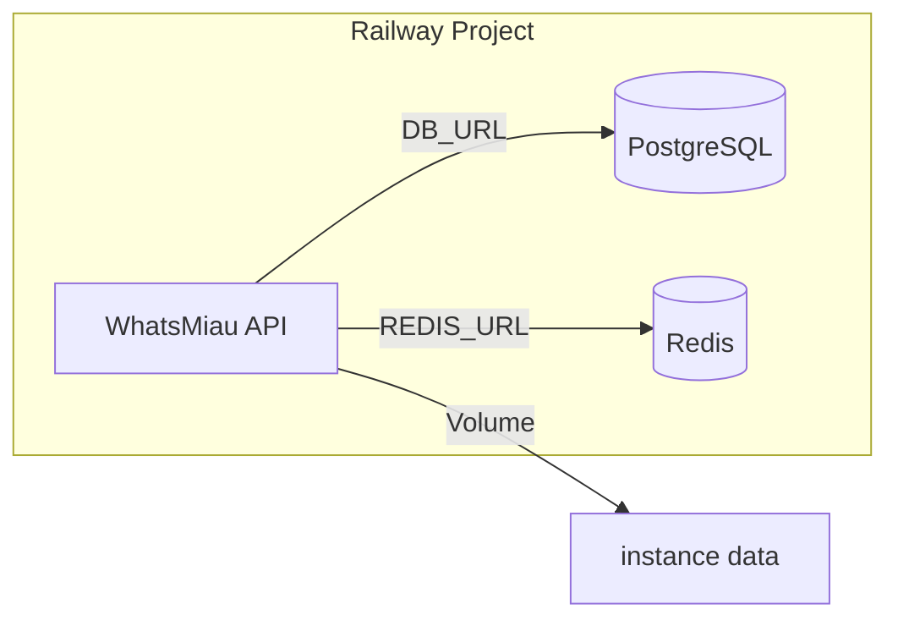

# WhatsMiau Railway Template

[](https://railway.com/new)

Railway deployment template for [WhatsMiau](https://github.com/verbeux-ai/whatsmiau), a lightweight WhatsApp backend service built with Go using the Whatsmeow library.

## Overview

This template enables one-click deployment of WhatsMiau on Railway with PostgreSQL and Redis. WhatsMiau provides an HTTP API compatible with Evolution API routes, allowing WhatsApp integration without requiring official WhatsApp Business API approval.

**Target users:** Developers and small businesses needing a lightweight WhatsApp automation backend.

**Tech stack:** WhatsMiau (Go), PostgreSQL, Redis, Docker.

## Architecture



- **WhatsMiau:** Main service exposing REST endpoints (port 8080)
- **PostgreSQL:** Persistence for instances and data
- **Redis:** Session storage and caching
- **Volume:** Persistent storage for WhatsApp instance auth data at `/app/data`

## Deployment

### Prerequisites

- Railway account
- GitHub repository connected (this template)

### Steps

1. **New Project** → Deploy from GitHub repo
2. **Add PostgreSQL** → Railway dashboard → New → Database → PostgreSQL
3. **Add Redis** → Railway dashboard → New → Database → Redis
4. **WhatsMiau service** → Connect this repo; Railway detects the Dockerfile
5. **Variables** → In the WhatsMiau service Variables tab:
   - Click **Suggested Variables** to import from `.env.example` (Railway detects it automatically)
   - Or add manually:

   | Variable | Value |
   |----------|-------|
   | `DIALECT_DB` | `postgres` |
   | `DB_URL` | `${{Postgres.DATABASE_URL}}` |
   | `REDIS_URL` | `${{Redis.REDIS_URL}}` |
   | `API_KEY` | `${{secret(64, "abcdef0123456789")}}` (auto-generates hex secret) or your own value |

6. **Volume** → WhatsMiau service → Settings → Volumes → Add Volume → Mount path: `/app/data`
7. **Generate Domain** → WhatsMiau service → Settings → Generate Domain → Enable public domain

### Variable Detection and Auto-Generation

Railway automatically detects variables from `.env.example` when you connect a repository. In the service Variables tab, use **Suggested Variables** to import them.

For secrets and passwords, use **template variable functions** so Railway generates random values when someone deploys the template:

| Variable | Value (for template) | Effect |
|----------|----------------------|--------|
| `API_KEY` | `${{secret(64, "abcdef0123456789")}}` | Generates a 32-byte hex string (like `openssl rand -hex 32`) |

Other functions: `secret(length, alphabet)` for custom secrets, `randomInt(min, max)` for integers. See [Railway Template Docs](https://docs.railway.app/guides/create#template-variable-functions).

### Creating a Template

After deployment, convert the project to a template:

1. Project Settings → Generate template from project
2. In the template composer, for the WhatsMiau service:
   - **Settings → Networking** → Enable **Public Networking** (HTTP) so the domain is auto-generated when users deploy
   - WhatsMiau listens on port 8080; Railway proxies to it (public URL uses HTTPS on 443)
3. Set `API_KEY` to `${{secret(64, "abcdef0123456789")}}` so it auto-generates on deploy
4. Add descriptions for variables (shown to users)
5. Publish via the template flow

## Environment Variables

| Variable | Required | Description |
|----------|----------|-------------|
| `API_KEY` | Yes | API key for requests (header: `apikey`) |
| `DIALECT_DB` | Yes | Set to `postgres` |
| `DB_URL` | Yes | PostgreSQL connection string |
| `REDIS_URL` | Yes | Redis connection string |
| `PORT` | No | Server port (default: 8080) |

## Local Development

1. Copy `.env.example` to `.env`:

   ```bash
   cp .env.example .env
   ```

2. Edit `.env` and set `API_KEY` to a secure value.

3. Start services:

   ```bash
   docker compose up -d
   ```

4. Access the API at `http://localhost:8080`.

## API Usage

WhatsMiau is compatible with Evolution API routes. Main endpoints:

| Method | Path | Description |
|--------|------|-------------|
| POST | `/v1/instance` | Create a new instance |
| GET | `/v1/instance` | List all instances |
| POST | `/v1/instance/:id/connect` | Connect to an instance |
| POST | `/v1/message/sendText/:instance` | Send a text message |

Evolution API compatibility routes (e.g. `POST /v1/instance/create`, `POST /v1/message/sendText/:instance`) are also supported.

Full documentation: [WhatsMiau GitHub](https://github.com/verbeux-ai/whatsmiau).

## Maintenance

- **Logs:** Railway dashboard → WhatsMiau service → Deployments → View logs
- **Updates:** Update Dockerfile to use newer `impedr029/whatsmiau:vX.Y.Z` and redeploy
- **Backup:** Export PostgreSQL data and volume contents if needed
